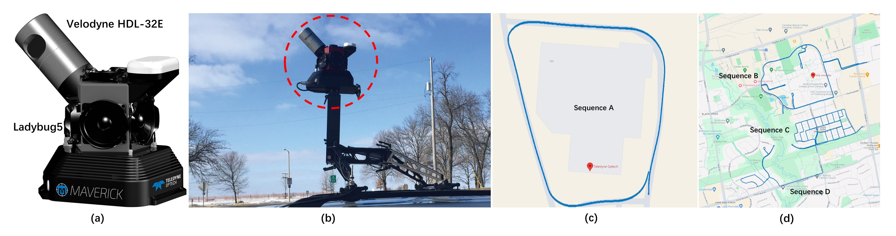
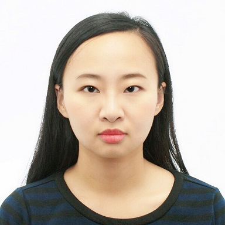
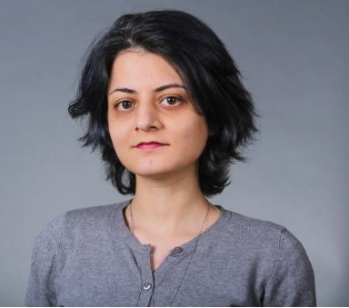
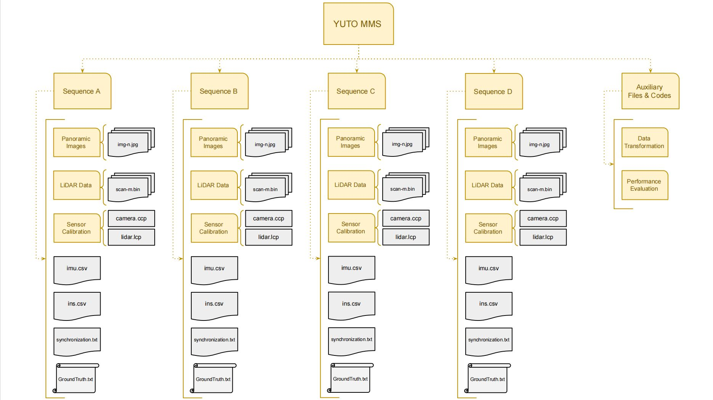

## **YUTO MMS: A Comprehensive Mobile Mapping Dataset for Enhanced SLAM Research**

The York University Teledyne Optech (YUTO) Mobile Mapping System (MMS) Dataset, encompassing four extensive sequences totalling 18.9 kilometres, was thoroughly assembled through two data collection expeditions on August 12,
2020, and June 21, 2019. Acquisitions were performed using a uniquely equipped vehicle, fortified with a panoramic camera, a tilted LiDAR, a Global Positioning System (GPS), and an Inertial Measurement Unit (IMU), journeying through
two strategic locations: the York University Keele Campus in Toronto and the Teledyne Optech headquarters in City of Vaughan, Canada. This is a robust benchmark of prevailing Simultaneous Localization and Mapping (SLAM) systems. 
This dataset was created by a team of [AUSM Lab](https://gunhosohn.me/).


For more details on YUTO MMS dataset, please refer to our [paper](#paper).  

<center>
    <a href="https://github.com/ausmlab/yutomms/tree/main/images/maverick_route.jpg"> 
        
      </a>
</center>

## **Paper**

[**YUTO MMS: A Comprehensive Mobile Mapping Dataset for Enhanced SLAM Research**](https://www.researchgate.net/profile/Yujia-Zhang-29)  
Yujia Zhang, SeyedMostafa Ahmadi, Jungwon Kang, Zahra Arjmandi and Gunho Sohn  
*The International Journal of Robotics Research, 2024*  

```markdown
@Article{rs15133383,
AUTHOR = {Zhang, Yujia and Kang, Jungwon and Sohn, Gunho},
TITLE = {PVL-Cartographer: Panoramic Vision-Aided LiDAR Cartographer-Based SLAM for Maverick Mobile Mapping System},
JOURNAL = {Remote Sensing},
VOLUME = {15},
YEAR = {2023},
NUMBER = {13},
ARTICLE-NUMBER = {3383},
URL = {https://www.mdpi.com/2072-4292/15/13/3383},
ISSN = {2072-4292},
DOI = {10.3390/rs15133383}
}
```

## **Authors**

<div>
<div class="card">
  
  <div class="container">
    <a href="https://ausmlab.github.io/yutomms/">
    <h4><b>Yujia Zhang</b></h4>  
    </a>
  </div>
    
</div>
<div class="card">
  
  <div class="container">
    <a href="https://gunhosohn.me/mostafa-ahmedi/">
    <h4><b>SeyedMostafa Ahmadi</b></h4>  
    </a>
  </div>
    
</div>
<div class="card">
  
  <div class="container">
    <a href="https://gunhosohn.me/jungwon-kang/">
    <h4><b>Jungwon Kang</b></h4>
    </a>
  </div>
    
</div>
<div class="card">
  
  <div class="container">
    <a href="https://gunhosohn.me/zahra-arjmandi/">
    <h4><b>Zahra Arjmandi</b></h4>  
    </a>
  </div>
    
</div>
<div class="card">
  
  <div class="container">
    <a href="https://gunhosohn.me/"> 
    <h4><b>Gunho Sohn</b></h4>  
    </a>
  </div> 
</div>
</div>


### **Dataset Description**

The directory structure of our YUTO MMS dataset is shown in the following figure.  

<center>
    <a href="https://github.com/ausmlab/yutomms/tree/main/images/YUTO-Dataset-directory-structure.JPG"> 
        
      </a>
</center>

**Panoramic images general information**

Sequence | Image file format | Image w*h | Number of images | Min file size | Max file size | Average file size | Total directory volume 
------------ | ------------- | ------------- | ------------- | ------------- | ------------- | ------------- | ------------- 
A | JPG | 2000*1000 | 717  | 1368 KB | 1592 KB  | 1484 KB | 1.06 GB   
B | JPG | 2000*1000 | 8382  | 456 KB | 828 KB  | 541 KB | 4.5 GB     
C | JPG | 2000*1000 | 10776  | 468 KB | 636 KB  | 542 KB | 5.8 GB    
D | JPG | 2000*1000 | 4500  | 452 KB | 1012 KB  | 561 KB | 2.5 GB    

**LiDAR data general information**

Sequence | LiDAR file format | Number of images | Min file size | Max file size | Average file size | Total directory volume 
------------ | ------------- | ------------- | ------------- | ------------- | ------------- | -------------
A | .bin | 1432 | 124 KB | 648 KB  | 422 KB | 604.8 GB   
B | .bin | 17395 | 16 KB | 644 KB  | 464 KB | 7.7 GB     
C | .bin | 22992 | 24 KB | 708 KB  | 470 KB | 10.3 GB    
D | .bin | 9615 | 380 KB | 668 KB  | 485 KB | 4.6 GB    

**Dataset Evaluation**

Sequence | ORB-SLAM2 | VINS | RPV-SLAM | HDPV-SLAM | LOAM | Cartographer | PVL-Cartographer 
------------ | ------------- | ------------- | ------------- | ------------- | ------------- | ------------- | -------------
A | 5.894 | 3.997 | 1.618  | 1.4 | Fail  | 4.023 | 0.766  
B | 100.870 | 86.897 | 12.910  | 9.58 | Fail  | 152.230 | 2.599  
C | 155.908 | 160.765 | 30.661  | 11.93 | Fail  | 183.619 | 3.739  
D | 10.665 | 12.875 | 5.673  | 4.69 | Fail  | 58.576 | 2.204  


## **Download**

- To download the YUTO MMS dataset, [download YUTO MMS](/download.md).

## **News**

To get the udpates of YUTO dataset, [news](/news.md).

